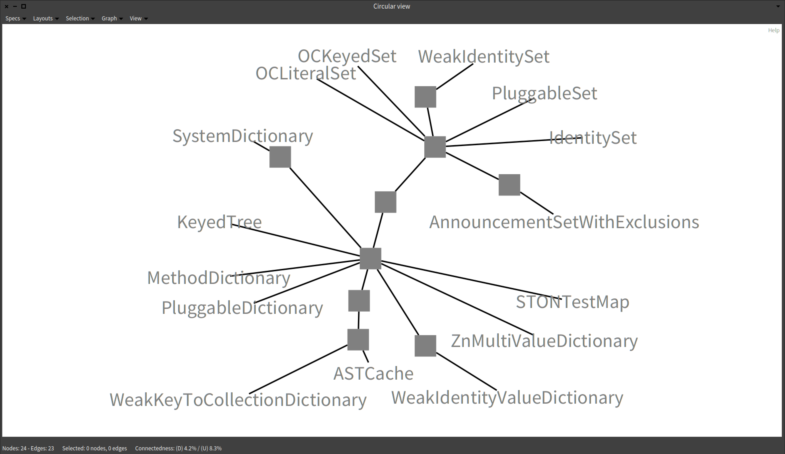
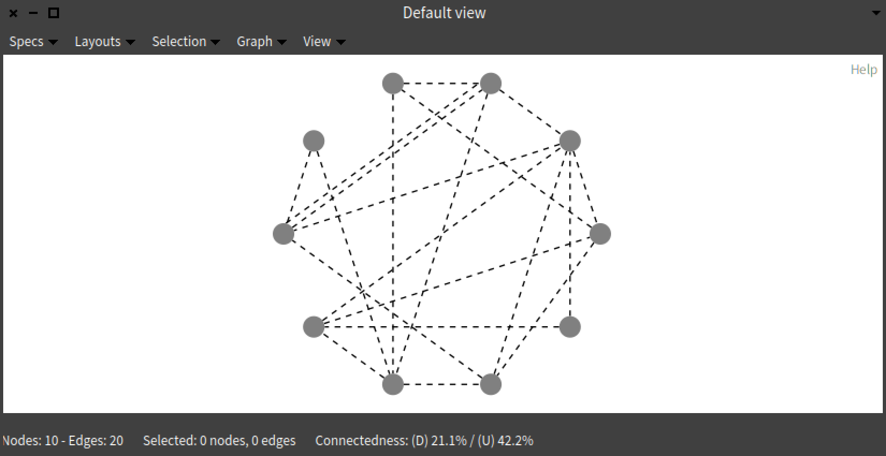

# Vizor

Vizor is a graph visualization and interactive exploration library developed by [Aron Fiechter](https://aronfiechter.com) and [Marco Raglianti](https://www.inf.usi.ch/phd/raglianti/) @ [REVEAL](https://reveal.si.usi.ch).

With Vizor you can:
 - create graphs of objects
 - map metrics to the nodes and edges representing such objects
 - select entities manually or programmatically and spawn new subgraphs to refine your exploration
 - choose how to layout entities on the canvas
 - leverage predefined view specifications or create custom ones to visualize a subset of the nodes and edges
 - ...

Vizor is developed in [Pharo](https://pharo.org), tested with Pharo 8, and released under MIT License.

## Installation and Usage

### Load from Metacello

To add Vizor to a Pharo image you can run the following command in a playground.

```st
Metacello new
    baseline: 'Vizor';
    repository: 'github://USIREVEAL/vizor:main';
    load.
```
### Vizor as a library

If you wish to set a dependency to Vizor in your application, you simply need to add the following in your baseline:

```st
| vizorVersion |
vizorVersion := 'main'.
spec
    baseline: 'Vizor'
    with: [
        spec repository: 'github://USIREVEAL/vizor:' , vizorVersion
    ]
```

### Usage

See examples in `Vizor-GUI - Examples`.

<div>
    
    
</div>

## Publications

Vizor was used in the following scientific research papers:

 - Raglianti, M., Nagy, C., Minelli, R., & Lanza, M. (2022). _DiscOrDance: Visualizing Software Developers Communities on Discord_. Proceedings of ICSME 2022 (38th International Conference on Software Maintenance and Evolution), pages 474-478, IEEE.
 - Raglianti, M., Nagy, C., Minelli, R., & Lanza, M. (2022). _Using Discord Conversations as Program Comprehension Aid_. Proceedings of ICPC 2022 (30th International Conference on Program Comprehension), pages 597-601, ACM.
 - Raglianti, M., Minelli, R., Nagy, C., & Lanza, M. (2021). _Visualizing Discord Servers_. Proceedings of VISSOFT 2021 (9th Working Conference on Software Visualization), pages 150-154, IEEE.
 - Fiechter, A., Minelli, R., Nagy, C., & Lanza, M. (2021). _Visualizing GitHub Issues_. In VISSOFT 2021 (9th Working Conference on Software Visualization), pages 155-159, IEEE.
